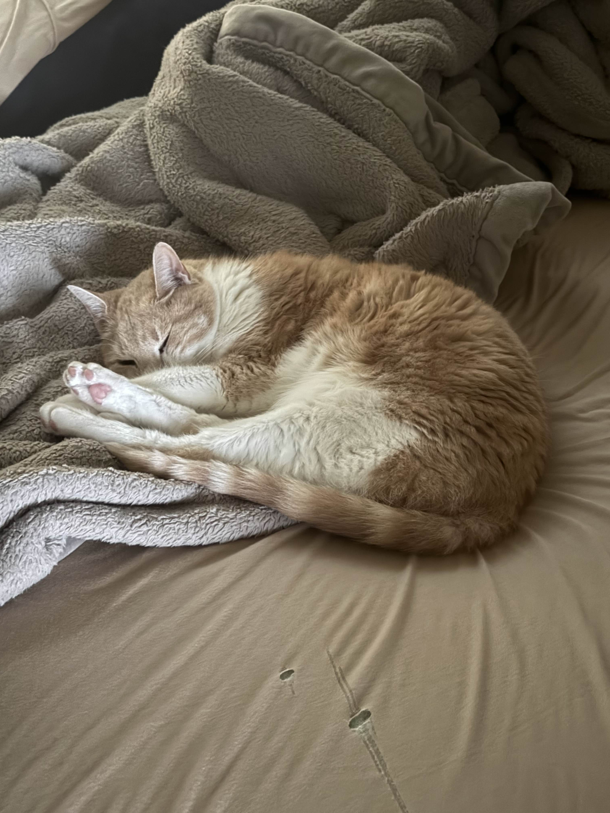
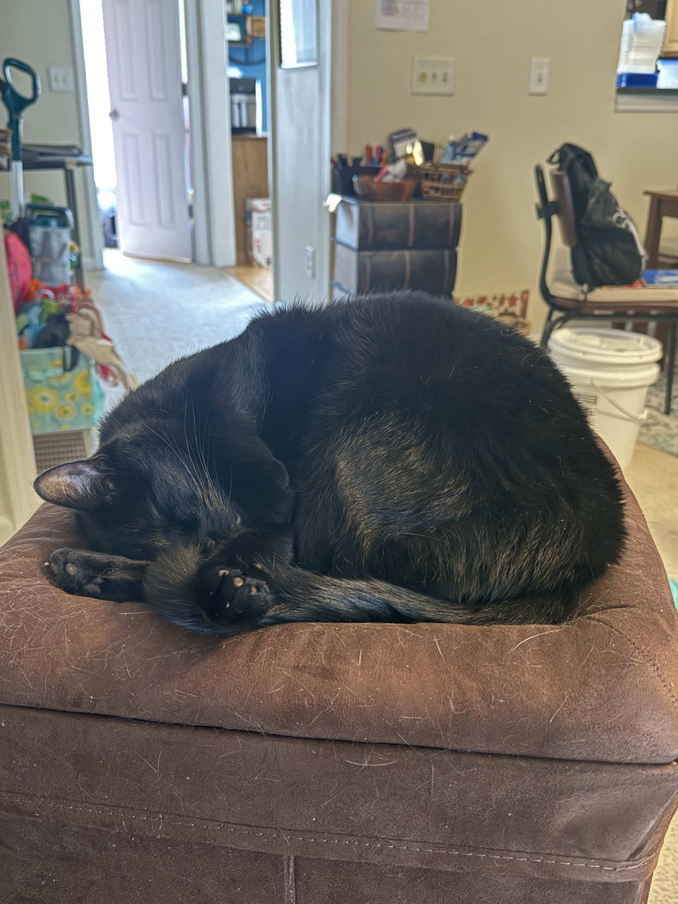

# 517-Kolski-Cats
Docs as code practice #2

## Our Cats

We have 2 cats, and they are both over 10 years old.

We think both cats are [American shorthairs](https://en.wikipedia.org/wiki/American_Shorthair) but we haven't tried to DNA test or check.

[Here is more information](https://www.purina.com/cats/cat-breeds/american-shorthair) about American shorthair cats.

### Pez

Pez has a lot of nicknames:
- Pez
- Pezzles
- Sir Pezzington
- Agent Orange
- MeowMix
- Stinky
- Little Man

### Toothless

Toothless has a lot of nicknames:
- Toothless
- Toodles
- Toodle-bop
- Toodelus Boppenheimer
- Little Void
- Baby Man

1. I don’t know a good way to work in a numbered list
2. So I’m throwing it down here
3. Hahaha
